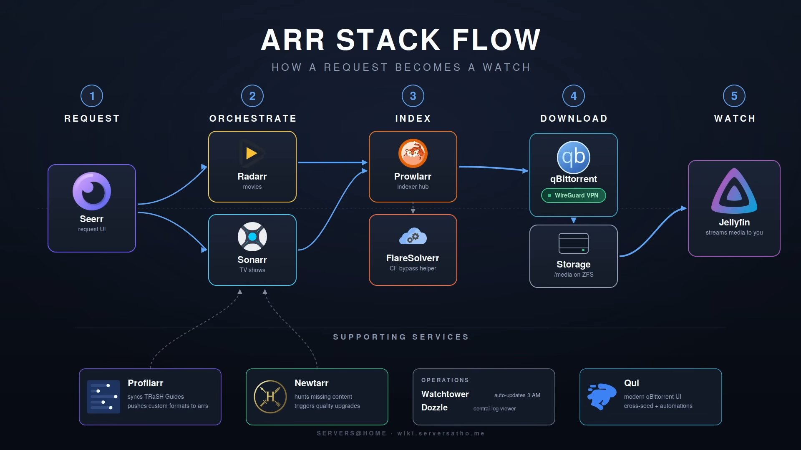

## Apps - [awsome](https://github.com/Ravencentric/awesome-arr)


* Media Manager:
  * legacy `SickBeard → SickRage → SickChill / SickGear`: now use *arr stack
  * [Radarr](https://github.com/Radarr/Radarr) - Movies
  * [Sonarr](https://github.com/sonarr/sonarr) - TV Shows
  * [Bazarr](https://github.com/morpheus65535/bazarr) -> [Bazarr+](https://github.com/LavX/bazarr) - Subtitles
  * [Lidarr](https://github.com/lidarr/Lidarr) - Musics
  * [Whisparr](https://github.com/whisparr/whisparr) - X Videos
  * ~~[Readarr](https://github.com/readarr/readarr)~~ -> [Bindery](https://github.com/vavallee/bindery) - Books
  * [Kapowarr](https://github.com/Casvt/Kapowarr) - Comics
  * [Questarr](https://github.com/Doezer/Questarr) - Video games
* Index Manager:
  * Newznab API: [NZBHydra](https://github.com/theotherp/nzbhydra2), NZBGeek, NZBFinder, NZBPlanet, DrunkenSlug,...
  * Torznab API: [Prowlarr](https://github.com/prowlarr/prowlarr), [Jackett](https://github.com/Jackett/Jackett)
* Download clients: [qBittorrent](https://github.com/qbittorrent/qBittorrent) (torrernt), [SABnzbd](https://github.com/sabnzbd/sabnzbd) (usenet), [slskd](https://github.com/slskd/slskd) (Soulseek), [Decypharr](https://github.com/sirrobot01/decypharr) (Debrid)
* Media server: [Jellyfin](https://github.com/jellyfin/jellyfin) (movies), [Navidrome](https://github.com/navidrome/navidrome/) (musics), [Kavita](https://github.com/Kareadita/Kavita) (books), [Seanime](https://github.com/5rahim/seanime) (anime & manga)
* Quality Profile: [profilarr](https://github.com/Dictionarry-Hub/profilarr), [recyclarr](https://recyclarr.dev/)
* Monitor: [Tracearr](https://github.com/connorgallopo/tracearr), [Tautulli](https://github.com/tautulli/tautulli) (Plex)
* Request: [Seearr](https://github.com/seerr-team/seerr), [MusicSeearr](https://github.com/HabiRabbu/Musicseerr)
* Dashboard: [Homarr](https://homarr.dev/) (web), [Helmarr](https://helmarr.com/) (iOS)
* Misc:
  * [lingarr](https://github.com/lingarr-translate/lingarr): Subtitle Translation
  * [Trailarr](https://github.com/nandyalu/trailarr): download and manage trailers
  * [Tdarr](https://github.com/HaveAGitGat/Tdarr): Distributed transcode automation

## Media
* Video:
  * Jellyfin
  * Plex
  * Kodi
  * [Stemio](https://github.com/Stremio/stremio-core): for streaming
  * [Seanime](https://github.com/5rahim/seanime): for anime & manga
    > Seanime = AniList + downloader + player (Denshi) + manga reader + media server

* Music:
  * [Navidrome](https://github.com/navidrome/navidrome/): [clients](https://www.navidrome.org/apps/)
  * API: Subsonic / [OpenSubsonic](https://opensubsonic.netlify.app/)
* Book:
  * [Komga](https://github.com/gotson/komga): [clients](https://komga.org/docs/category/readers)
  * [Kavita](https://github.com/Kareadita/Kavita): [clients](https://wiki.kavitareader.com/guides/3rdparty/tachi-like/)
  * [BookLore](https://github.com/booklore-app/booklore) -> [Grimmory](https://github.com/grimmory-tools/grimmory)
  * client [Mihon](https://mihon.app/) & [forks](https://mihon.app/forks/)
  * API: [OPDS](https://opds.io/): [OPDS-PSE](https://github.com/anansi-project/opds-pse) (Page Streaming Extension) - unofficial extension

## Metadata
* Inspect from file:
  ```bash
  mediainfo <file> [--Output=JSON]

  # or
  ffprobe [-analyzeduration 100M] [-probesize 100M] -i video.mkv
  ```
* Movies: [IMDB](https://imdb.com/), [TMDB](https://themoviedb.org/), [TVDB](https://www.thetvdb.com/), [OMDb](https://omdbapi.com/)
* Musics: [MusicBrainz](https://musicbrainz.org/)
* Anime: [MyAnimeList](https://myanimelist.net/), [AniList](https://anilist.co/), [AniDB](https://anidb.net/)
  * [Shoko](https://shokoanime.com/) - server/plugin for Media player
* Books: [OpenLibrary](https://openlibrary.org/)
* Comics: [ComicVine](https://comicvine.gamespot.com/)
* Games: [IGDB](https://igdb.com/)
* Discs release
  * [Blu-ray.com](https://www.blu-ray.com/) - This is the ultimate, definitive global database for physical media.
  * [Caps-a-holic.com](https://caps-a-holic.com/) - compare video Quality & Bitrates

## Networks
* Torrent
  * client: [qBittorrent](https://github.com/qbittorrent/qBittorrent)
* Usenet:
  * client: [NZBGet](https://github.com/nzbgetcom/nzbget) | [SABnzbd](https://github.com/sabnzbd/sabnzbd)
* Soulseek
  * client: [slskd](https://github.com/slskd/slskd) | [Nicotine+](https://github.com/nicotine-plus/nicotine-plus)
* Debrid: [compare](https://github.com/fynks/debrid-services-comparison)
  * service: [Real-Debrid](https://real-debrid.com/) | [AllDebrid](https://alldebrid.com/) | [TorBox](https://torbox.app/)
  * client: [Decypharr](https://github.com/sirrobot01/decypharr)
  * Stremio addons:
    * [comet](https://github.com/g0ldyy/comet)
    * [Torrentio](https://stremio-addons.net/addons/torrentio)
* Online:
  * [pyLoad](https://github.com/pyload/pyload)

## References

* TRaSH Guide: [Profilarr vs. Recyclarr](https://corelab.tech/profilarr-vs-trash/)
* [DUMB](https://dumbarr.com/) - A Unified Media Solution
* [Riven](https://riven.tv/) - self-hosted media automation system
* [ElfHosted](https://docs.elfhosted.com/) - managed “self-hosting services” platform
